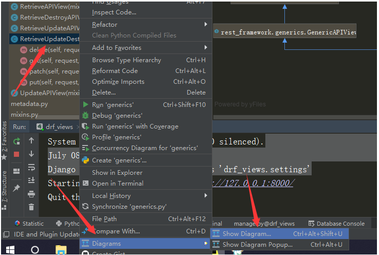

# 昨日回顾

```python
#1 Serializer类，需要序列化什么，必须写一个类继承，想序列化什么字段，就在里面写字段，source的作用（很多字段类）
#2 序列化queryset（列表）对象和真正的对象，many=True的作用，instance=要序列化的对象，


#3 反序列化 instance=要序列化的对象,data=request.data
#4 字段验证，序列化类中，给字段加属性，局部和全局钩子函数，字段属性的validators=[check_author]
#5 当在视图中调用 序列化对象.is_valid()   boo_ser.is_valid(raise_exception=True) 只要验证不通过，直接抛异常
#6 修改保存---》调用序列化对象.save(),重写Serializer类的update方法
	    def update(self, instance, validated_data):
            #instance是book这个对象
            #validated_data是校验后的数据
            instance.name=validated_data.get('name')
            instance.price=validated_data.get('price')
            instance.author=validated_data.get('author')
            instance.publish=validated_data.get('publish')
            instance.save()  #book.save()   django 的orm提供的
            return instance
#7 序列化得到字典，序列化对象.data  
#8 自己定义了一个Response对象
	class MyResponse():
        def __init__(self):
            self.status=100
            self.msg='成功'
        @property
        def get_dict(self):
            return self.__dict__
        
#9 反序列化的新增 序列化类(data=request.data),如果只传了data，当调用  序列化对象.save()，会触发序列化类的create方法执行，当传了instance和data时，调用 序列化对象.save()，会触发序列化类的update方法执行
#10 重写create方法（可以很复杂）
	    def create(self, validated_data):
            instance=Book.objects.create(**validated_data)
            return instance
#11 ModelSerializer 跟Model做了一个对应
	class BookModelSerializer(serializers.ModelSerializer):
        def validate_price（self, data）:
            pass
        publish=serializers.CharField(source='publish.name')
        class Meta:
            model=Book  # 对应上models.py中的模型
            fields='__all__'
            # fields=('name','price','id','author','publish') # 只序列化指定的字段
            # exclude=('name',) #跟fields不能都写，写谁，就表示排除谁
            # read_only_fields=('price',)
            # write_only_fields=('id',) #弃用了，使用extra_kwargs
            extra_kwargs = {  # 类似于这种形式name=serializers.CharField(max_length=16,min_length=4)
                'price': {'write_only': True,max_length:16,min_length:4},
                
            }
            
#12 如果在ModelSerializer中写一个局部钩子或者全局钩子，如何写？
	-跟之前一模一样
#13 many=True 能够序列化多条的原因---》__new__是在__init__之前执行的，造出一个空对象
#14 接口：统一子类的行为
```


# 今日内容

## 1 请求和响应

### 1.1 请求

```python
# 请求对象
# from rest_framework.request import Request
    def __init__(self, request, parsers=None, authenticators=None,
                 negotiator=None, parser_context=None):
        # 二次封装request，将原生request作为drf request对象的 _request 属性
        self._request = request
    def __getattr__（self，item）：
    	return getattr(self._request,item)
# 请求对象.data:前端以三种编码方式传入的数据，都可以取出来
# 请求对象..query_params 与Django标准的request.GET相同，只是更换了更正确的名称而已。
        
```

### 1.2 响应

```python
#from rest_framework.response import Response
 def __init__(self, data=None, status=None,
                 template_name=None, headers=None,
                 exception=False, content_type=None):
        
#data：你要返回的数据，字典
#status：返回的状态码，默认是200，
	-from rest_framework import status在这个路径下，它把所有使用到的状态码都定义成了常量
#template_name 渲染的模板名字（自定制模板），不需要了解
#headers:响应头，可以往响应头放东西，就是一个字典
#content_type：响应的编码格式，application/json和text/html;

# 浏览器响应成浏览器的格式，postman响应成json格式，通过配置实现的（默认配置）
#不管是postman还是浏览器，都返回json格式数据
# drf有默认的配置文件---》先从项目的setting中找，找不到，采用默认的
# drf的配置信息，先从自己类中找--》项目的setting中找---》默认的找
	-局部使用:对某个视图类有效
        -在视图类中写如下
        from rest_framework.renderers import JSONRenderer
        renderer_classes=[JSONRenderer,]
    -全局使用：全局的视图类，所有请求，都有效
    	-在setting.py中加入如下
        REST_FRAMEWORK = {
            'DEFAULT_RENDERER_CLASSES': (  # 默认响应渲染类
                'rest_framework.renderers.JSONRenderer',  # json渲染器
                'rest_framework.renderers.BrowsableAPIRenderer',  # 浏览API渲染器
            )
        }
```


## 2 视图

```python
# 两个视图基类
APIView
GenericAPIView
```

### 2.1 基于APIView写接口

```python
#### views.py
from rest_framework.generics import GenericAPIView
from app01.models import Book
from app01.ser import BookSerializer
# 基于APIView写的
class BookView(APIView):
    def get(self,request):
        book_list=Book.objects.all()
        book_ser=BookSerializer(book_list,many=True)

        return Response(book_ser.data)
    def post(self,request):
        book_ser = BookSerializer(data=request.data)
        if book_ser.is_valid():
            book_ser.save()
            return Response(book_ser.data)
        else:
            return Response({'status':101,'msg':'校验失败'})


class BookDetailView(APIView):
    def get(self, request,pk):
        book = Book.objects.all().filter(pk=pk).first()
        book_ser = BookSerializer(book)
        return Response(book_ser.data)

    def put(self, request,pk):
        book = Book.objects.all().filter(pk=pk).first()
        book_ser = BookSerializer(instance=book,data=request.data)
        if book_ser.is_valid():
            book_ser.save()
            return Response(book_ser.data)
        else:
            return Response({'status': 101, 'msg': '校验失败'})

    def delete(self,request,pk):
        ret=Book.objects.filter(pk=pk).delete()
        return Response({'status': 100, 'msg': '删除成功'})
    
#models.py
class Book(models.Model):
    name=models.CharField(max_length=32)
    price=models.DecimalField(max_digits=5,decimal_places=2)
    publish=models.CharField(max_length=32)
#ser.py
class BookSerializer(serializers.ModelSerializer):
    class Meta:
        model=Book
        fields='__all__'
# urls.py
path('books/', views.BookView.as_view()),
re_path('books/(?P<pk>\d+)', views.BookDetailView.as_view()),
```

### 2.2  基于GenericAPIView写的接口

```python
# views.py
class Book2View(GenericAPIView):
    #queryset要传queryset对象，查询了所有的图书
    # serializer_class使用哪个序列化类来序列化这堆数据
    queryset=Book.objects
    # queryset=Book.objects.all()
    serializer_class = BookSerializer
    def get(self,request):
        book_list=self.get_queryset()
        book_ser=self.get_serializer(book_list,many=True)

        return Response(book_ser.data)
    def post(self,request):
        book_ser = self.get_serializer(data=request.data)
        if book_ser.is_valid():
            book_ser.save()
            return Response(book_ser.data)
        else:
            return Response({'status':101,'msg':'校验失败'})


class Book2DetailView(GenericAPIView):
    queryset = Book.objects
    serializer_class = BookSerializer
    def get(self, request,pk):
        book = self.get_object()
        book_ser = self.get_serializer(book)
        return Response(book_ser.data)

    def put(self, request,pk):
        book = self.get_object()
        book_ser = self.get_serializer(instance=book,data=request.data)
        if book_ser.is_valid():
            book_ser.save()
            return Response(book_ser.data)
        else:
            return Response({'status': 101, 'msg': '校验失败'})

    def delete(self,request,pk):
        ret=self.get_object().delete()
        return Response({'status': 100, 'msg': '删除成功'})
    
 #url.py
    # 使用GenericAPIView重写的
    path('books2/', views.Book2View.as_view()),
    re_path('books2/(?P<pk>\d+)', views.Book2DetailView.as_view()),
```

### 2.3 基于GenericAPIView和5个视图扩展类写的接口

```python
from rest_framework.mixins import  ListModelMixin,CreateModelMixin,UpdateModelMixin,DestroyModelMixin,RetrieveModelMixin
# views.py
class Book3View(GenericAPIView,ListModelMixin,CreateModelMixin):

    queryset=Book.objects
    serializer_class = BookSerializer
    def get(self,request):
        return self.list(request)

    def post(self,request):
        return self.create(request)

class Book3DetailView(GenericAPIView,RetrieveModelMixin,DestroyModelMixin,UpdateModelMixin):
    queryset = Book.objects
    serializer_class = BookSerializer
    def get(self, request,pk):
        return self.retrieve(request,pk)

    def put(self, request,pk):
        return self.update(request,pk)

    def delete(self,request,pk):
        return self.destroy(request,pk)
# urls.py
    # 使用GenericAPIView+5 个视图扩展类  重写的
    path('books3/', views.Book3View.as_view()),
    re_path('books3/(?P<pk>\d+)', views.Book3DetailView.as_view()),
```

### 3.4 使用ModelViewSet编写5个接口

```python
# views.py
from rest_framework.viewsets import ModelViewSet
class Book5View(ModelViewSet):  #5个接口都有，但是路由有点问题
    queryset = Book.objects
    serializer_class = BookSerializer
    
# urls.py
# 使用ModelViewSet编写5个接口
    path('books5/', views.Book5View.as_view(actions={'get':'list','post':'create'})), #当路径匹配，又是get请求，会执行Book5View的list方法
    re_path('books5/(?P<pk>\d+)', views.Book5View.as_view(actions={'get':'retrieve','put':'update','delete':'destroy'})),


```

### 3.5 源码分析ViewSetMixin

```python
# 重写了as_view
# 核心代码（所以路由中只要配置了对应关系，比如{'get':'list'}）,当get请求来，就会执行list方法
for method, action in actions.items():
    #method：get
    # action：list
    handler = getattr(self, action)
    #执行完上一句，handler就变成了list的内存地址
    setattr(self, method, handler)
    #执行完上一句  对象.get=list
    #for循环执行完毕 对象.get:对着list   对象.post：对着create


```

### 3.6 继承ViewSetMixin的视图类

```python
# views.py
from rest_framework.viewsets import ViewSetMixin
class Book6View(ViewSetMixin,APIView): #一定要放在APIVIew前
    def get_all_book(self,request):
        print("xxxx")
        book_list = Book.objects.all()
        book_ser = BookSerializer(book_list, many=True)
        return Response(book_ser.data)
    
# urls.py
    #继承ViewSetMixin的视图类，路由可以改写成这样
    path('books6/', views.Book6View.as_view(actions={'get': 'get_all_book'})),

```


# 补充

### 1 在pycharm中查看类的继承关系




# 作业

## 1 自己封装一个CommonResponse对象，使用方法如下

```python
        return CoomonResponse('100','成功',boo_ser.data)
        return CoomonResponse('101','验证失败',boo_ser.errors)
```

# 2 什么是正向代理，什么是反向代理

## 3 大家都写：分别用APIView，GenericAPIView，5个视图扩展类，GenericAPIView和5个视图扩展类写的接口和ModelViewSet写5个接口

## 4 今天讲的所有视图类的继承关系，写出来

